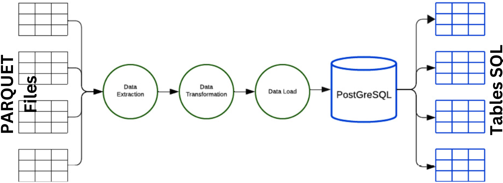
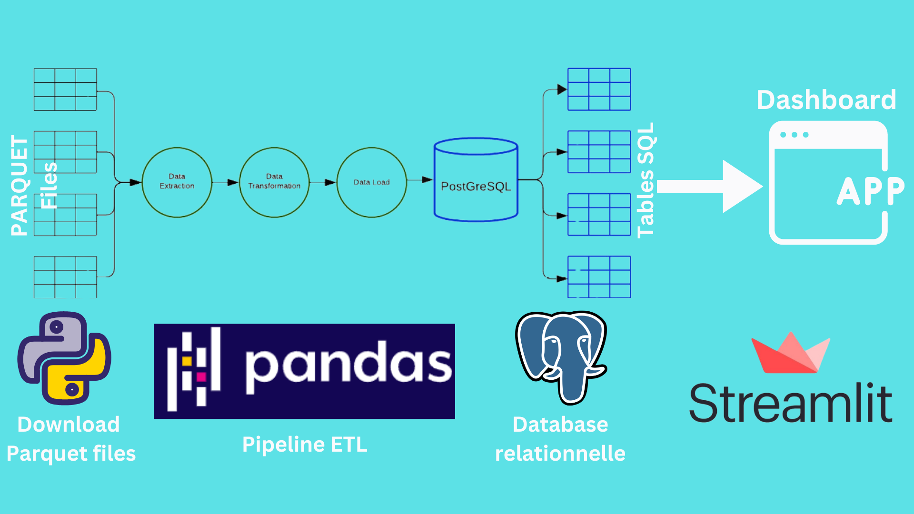
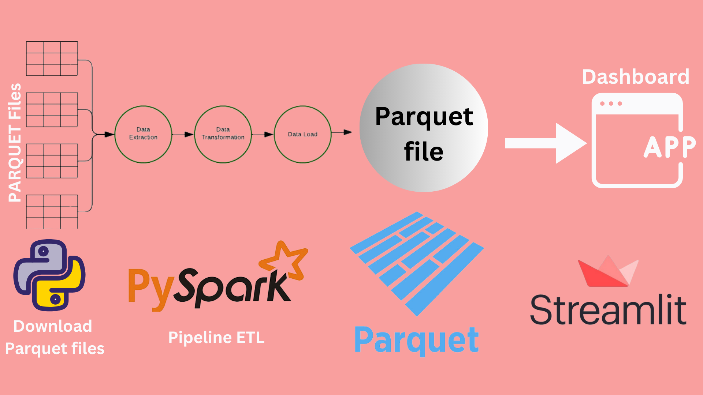

# **Analysis of New York Taxi Trips**

*Author: [Josue AFOUDA](https://www.linkedin.com/in/josu%C3%A9-afouda/)*

## Introduction


The transportation sector, particularly taxi service, is a crucial part of New York's urban infrastructure. With millions of trips taken each year, the data generated by these trips provides a wealth of valuable information. This Data Science project aims to explore and analyze New York City taxi trip data, collected by the New York City Taxi and Limousine Commission (TLC), with the aim of generating actionable insights and developing predictive models using Machine Learning techniques.

## Scenario


A newly hired Data Scientist at a transportation analytics firm embarks on a project to analyze New York City taxi trip data sourced from the NYC Taxi and Limousine Commission (TLC). The dataset includes detailed records of yellow and green taxi trips, as well as For-Hire Vehicle (FHV) trip records. The goal of the project is to extract valuable insights from the vast amount of trip data, ultimately contributing to optimizing transportation services and informing policy decisions.

## Part 1 : Data Collection and ETL Process for Loading Data into a PostgreSQL Database



The first stage of this project involves collecting taxi trip data from New York City from the official source provided by the NYC Taxi and Limousine Commission (TLC). This collection requires a thorough understanding of TLC's policies and regulations regarding data usage.

Once the data is collected, the Extract, Transform, Load (ETL) process is initiated to prepare the data for integration into a PostgreSQL database. Here are the detailed steps of the ETL process:

**Extraction**:

The data is extracted from the source files downloaded from the TLC website (https://www.nyc.gov/site/tlc/about/tlc-trip-record-data.page). Actually, these files are in PARQUET format like specified by the source.

Here the description of each variable for yellow taxi data:

1. **VendorID** : Un code indiquant le fournisseur TPEP qui a fourni l'enregistrement. 1= Creative Mobile Technologies, LLC; 2= VeriFone Inc.

2. **tpep_pickup_datetime** : La date et l'heure auxquelles le compteur a été engagé.

3. **tpep_dropoff_datetime** : La date et l'heure auxquelles le compteur a été désengagé.

4. **Passenger_count** : Le nombre de passagers dans le véhicule. Ceci est une valeur saisie par le conducteur.

5. **Trip_distance** : La distance de voyage écoulée en miles rapportée par le taximètre.

6. **RateCodeID** : Le code tarifaire final en vigueur à la fin du voyage.
   1= Tarif standard
   2= JFK
   3= Newark
   4= Nassau ou Westchester
   5= Tarif négocié
   6= Trajet en groupe

7. **Store_and_fwd_flag** : Ce drapeau indique si l'enregistrement du voyage a été conservé en mémoire dans le véhicule avant d'être envoyé au fournisseur, autrement dit "stockage et transmission différée", car le véhicule n'avait pas de connexion au serveur.
   Y= Voyage enregistré et transmis ultérieurement
   N= Pas de voyage enregistré et transmis ultérieurement

8. **PULocationID** : Zone de taxi TLC dans laquelle le taximètre a été engagé.

9. **DOLocationID** : Zone de taxi TLC dans laquelle le taximètre a été désengagé.

10. **Payment_type** : Un code numérique indiquant comment le passager a payé pour le voyage.
    1= Carte de crédit
    2= Espèces
    3= Gratuit
    4= Litige
    5= Inconnu
    6= Voyage annulé

11. **Fare_amount** : Le montant du tarif calculé en fonction du temps et de la distance par le compteur.

12. **Extra** : Extras et suppléments divers. Actuellement, cela inclut uniquement les frais de $0,50 et $1 pour les heures de pointe et les trajets de nuit.

13. **MTA_tax** : Taxe MTA de $0,50 automatiquement déclenchée en fonction du tarif en cours d'utilisation.

14. **Tip_amount** : Montant du pourboire - Ce champ est automatiquement renseigné pour les pourboires par carte de crédit. Les pourboires en espèces ne sont pas inclus.

15. **Tolls_amount** : Montant total de tous les péages payés lors du voyage.

16. **Improvement_surcharge** : Supplément d'amélioration de $0,30 facturé au départ du drapeau. Le supplément d'amélioration a commencé à être prélevé en 2015.

17. **Total_amount** : Le montant total facturé aux passagers. Ne comprend pas les pourboires en espèces.

18. **Congestion_Surcharge** : Montant total collecté lors du voyage pour la surcharge de congestion de l'État de New York.

19. **Airport_fee** : $1.25 pour les prises en charge uniquement aux aéroports de LaGuardia et John F. Kennedy.


**Transformation**:

Once the data is extracted, it undergoes transformations to clean, structure, and prepare it for loading into the database.
Transformations may include cleaning the data by removing duplicates, correcting format errors, or handling missing values.
The data structure may also be modified to match the schema of the target database. For example, fields may be renamed, reformatted, or combined as needed for analysis.

**Loading**:

Once the data is cleaned and transformed, it is loaded into a PostgreSQL database.
Before loading, the Data Scientist creates an appropriate database schema to store the taxi trip data. This involves defining tables, columns, and constraints necessary to ensure data integrity.
The data is loaded into the database using suitable tools and programming languages, such as psycopg2 (for Python) or SQL commands.

Once this first part is completed, all taxi trip data will be integrated and ready for exploration and analysis in the PostgreSQL database. This process ensures that the data is organized efficiently and consistently, facilitating the subsequent steps of data analysis.

### Setting Up the Local Environment for Data Loading Activities into PostgreSQL

- Open pgAdmin 4.

- In the *Quick Links* section, click on *Add New Server*. Here are the details to fill in:

    - Name: ytaxi_ETL

    - Host: localhost

    - Port: 5432 (default value)

    - User: postgres (default value)

    - Password: enter your password

To create a database:

- Click on the server you just created.

- Right-click on *Databases*, then select *Create > Database*.

- Name: nyc_yellow_taxi_record

Here is the SQL code that generates the database *nyc_yellow_taxi_record*:

```sql
CREATE DATABASE nyc_yellow_taxi_record
    WITH
    OWNER = postgres
    ENCODING = 'UTF8'
    CONNECTION LIMIT = -1
    IS_TEMPLATE = False;

COMMENT ON DATABASE nyc_yellow_taxi_record
    IS 'Database for yellow taxi trips in New York City';
```

Here is the SQL code to create the table *ytaxi_histo* (using the PSQL tool in pgAdmin4):

```sql
CREATE TABLE ytaxi_histo (
    VendorID int NOT NULL,
    tpep_pickup_datetime timestamp NOT NULL,
    tpep_dropoff_datetime timestamp NOT NULL,
    passenger_count float NOT NULL,
    trip_distance float NOT NULL,
    RatecodeID float NOT NULL,
    store_and_fwd_flag varchar(1) NOT NULL,
    PULocationID int NOT NULL,
    DOLocationID int NOT NULL,
    payment_type int NOT NULL,
    fare_amount float NOT NULL,
    extra float NOT NULL,
    mta_tax float NOT NULL,
    tip_amount float NOT NULL,
    tolls_amount float NOT NULL,
    improvement_surcharge float NOT NULL,
    total_amount float NOT NULL,
    congestion_surcharge float NOT NULL,
    Airport_fee float NOT NULL
);
```

### Establishing Connection to a PostgreSQL Table to Retrieve Data

Begin by installing the necessary packages:

```python
pip install sqlalchemy
pip install psycopg2-binary
```

```python
from sqlalchemy import create_engine

# Define the connection information to the database
db_user = 'postgres'
db_password = '' # Enter your password
db_host = 'localhost'  # or the IP address of the database server
db_port = '5432'  # Default port for PostgreSQL
db_name = 'nyc_yellow_taxi_record'

# Create a connection to the database
engine = create_engine(f'postgresql://{db_user}:{db_password}@{db_host}:{db_port}/{db_name}')

# Name of the table to read
table_name = 'ytaxi_histo'

# Read data from the table into a DataFrame
df = pd.read_sql_table(table_name, con=engine)

# Display the first few rows of the DataFrame
print(df.head())
```

### Script to download and save data files: *download_data_files.py

This Python script `download_taxi_data.py` is designed to download yellow taxi trip data files in PARQUET format from 2019 to the current year and save them into a specified folder.

Here's a breakdown of the code:

- **Importing Libraries**: The script imports necessary libraries such as `os`, `requests`, `time`, `hashlib`, and `datetime`.

- **`download_histo_data` Function**: This function is defined to handle the download process. It takes one argument:
  - `path_to_histo_data_folder`: A string representing the path to the folder where the files will be saved.

- **Try-Except Block**: The main code is wrapped in a try-except block to catch and handle any potential errors that may occur during execution.

- **Creating Folder**: It checks if the folder specified by `path_to_histo_data_folder` exists. If not, it creates the folder using `os.makedirs()`.

- **Looping Over Years and Months**: It loops over the years from the current year to 2019 and for each year, it iterates over the months from January to December.

- **Constructing Download URL**: It constructs the download URL based on the year and month.

- **Checking File Existence**: It checks if the file already exists in the specified folder. If it does, it prints a message and skips to the next file.

- **Downloading File**: It attempts to download the file using `requests.get()` with error handling. If the download is successful (HTTP status code 200), it writes the content to a file in binary mode.

- **Pausing Between Downloads**: To avoid overloading the remote server, it pauses for 1 second between each download using `time.sleep(1)`.

- **Printing Completion Message**: Once all downloads are completed or if an error occurs, it prints a completion message.

- **Date Information**: It prints the date of the day when the historical data download is initiated.

- **Path to Save Data**: It specifies the path to the folder where historical data will be saved.

- **Function Call**: Finally, it calls the `download_histo_data` function with the specified path to download the historical data.

This script automates the process of downloading historical taxi trip data files, ensuring the availability of up-to-date data for analysis.


### ETL Functions/Scripts

- ***etl_functions.py***

1. **`extract(file_path)` Function**:
   - **Purpose**: This function is responsible for extracting data from a Parquet file and returning a pandas DataFrame.
   - **Parameters**:
     - `file_path (str)`: The path to the Parquet file.
   - **Returns**:
     - `pandas.DataFrame`: DataFrame containing the data from the Parquet file.
   - **Description**:
     - It sets up logging to record any information or errors during the extraction process.
     - Reads the Parquet file into a DataFrame using `pd.read_parquet()`.
     - Logs a success message if the extraction is successful and returns the DataFrame.
     - If any error occurs during the extraction process, it logs the error and returns `None`.

2. **`transform(df)` Function**:
   - **Purpose**: This function filters the DataFrame by removing observations with missing values in 'passenger_count' and 'total_amount' columns.
   - **Parameters**:
     - `df (pandas.DataFrame)`: Input DataFrame.
   - **Returns**:
     - `pandas.DataFrame`: Filtered DataFrame.
   - **Description**:
     - It sets up logging to record any information or errors during the transformation process.
     - Drops all rows with missing values using `df.dropna(axis=0)`.
     - Corrects the column names to lowercase using `df.rename(columns=str.lower)`.
     - Logs a success message if the transformation is successful and returns the filtered DataFrame.
     - If any error occurs during the transformation process, it logs the error and returns `None`.

3. **`load(df, table_name, connection_string)` Function**:
   - **Purpose**: This function loads data from a DataFrame into a PostgreSQL table.
   - **Parameters**:
     - `df (pandas.DataFrame)`: Input DataFrame.
     - `table_name (str)`: Name of the PostgreSQL table to load the data into.
     - `connection_string (str)`: PostgreSQL connection string.
   - **Returns**:
     - `bool`: True if data loading is successful, False otherwise.
   - **Description**:
     - It sets up logging to record any information or errors during the loading process.
     - Creates a database engine using the provided connection string.
     - Loads the DataFrame into the specified PostgreSQL table using `df.to_sql()`.
     - Closes the database connection using `engine.dispose()`.
     - Logs a success message if the data loading is successful and returns `True`.
     - If any error occurs during the loading process, it logs the error and returns `False`.


***etl_pipeline.py***

Here's a detailed breakdown of the `etl_pipeline.py` script:

1. **Imports**:
   - `os`: Provides functions to interact with the operating system, such as manipulating file paths.
   - `logging`: Enables logging functionality to record information or errors during script execution.
   - `etl_functions`: Contains custom functions for the ETL (Extract, Transform, Load) pipeline.

2. **Setting up Logging**:
   - Configures logging settings to write log messages to a file named `run_pipeline.log`.
   - Log messages include timestamps, log levels, and message content.

3. **Variables Initialization**:
   - `path_to_histo_data_folder`: Specifies the path to the folder containing historical data Parquet files.
   - `connection_string`: Defines the PostgreSQL connection string, including username, password, host, port, and database name.

4. **`run_pipeline` Function**:
   - **Purpose**: Executes the historical data ETL pipeline.
   - **Parameters**:
     - `path_to_histo_data_folder (str)`: Path to the folder containing historical data Parquet files.
     - `connection_string (str)`: PostgreSQL connection string.
   - **Steps**:
     - Lists all Parquet files in the specified folder.
     - For each Parquet file:
       - Constructs the full file path.
       - Extracts data from the Parquet file using `etl_functions.extract()`.
       - Transforms the extracted data using `etl_functions.transform()`.
       - Loads the transformed data into PostgreSQL using `etl_functions.load()` if transformation is successful.
     - Logs appropriate messages for each step, including success or failure.
   - **Error Handling**:
     - Catches and logs any exceptions that occur during the pipeline execution.

5. **Execution**:
   - Sets up database connection information.
   - Calls the `run_pipeline` function with the specified parameters (`path_to_histo_data_folder` and `connection_string`).

This script orchestrates the entire ETL process for historical data, including extraction, transformation, and loading into a PostgreSQL database. It ensures data consistency and integrity while providing detailed logging for monitoring and troubleshooting purposes.

### Order of execution of part 1

From the terminal, run these commands :

1. 

```bash
python3 download_data_files.py 
```

2. 

```bash
python3 etl_pipeline.py 
```

### Requirements for part 1

numpy==1.26.4

pandas==2.2.2

psycopg2-binary==2.9.9

pyarrow==16.0.0

requests==2.31.0

SQLAlchemy==2.0.30

**For data from January 2019 to February 2024, my table contains 106 197 954 rows**.

[Download all Python codes](https://buy.stripe.com/3cs186bZAgnofsYcN2)


# Approach: PARQUET -----------PANDAS----------> PostgreSQL



**Taxi Trip Analysis: ETL Approach with Parquet, Pandas, and PostgreSQL**

Analyzing New York City taxi trip data requires an efficient approach for extracting, transforming, and loading (ETL) the data. In this context, I opted for an approach that utilizes Parquet files available on the official website of New York City. Here's how this approach is implemented and the associated advantages and disadvantages of each technical choice.

**Data Extraction:**

After downloading the raw data files in Parquet format from the New York City website, I used the `pd.read_parquet` function of Pandas to extract the data from each file. This step is relatively simple and efficient due to Pandas' native support for Parquet. This allows for quick loading of data into Pandas DataFrames for further processing.

**Data Transformation:**

The necessary transformations on the taxi trip data were performed using the powerful features of Pandas. This includes operations such as data cleaning, handling missing values, calculating new features, and merging multiple DataFrames. Pandas' processing capabilities were used to transform the data into the required format for further analysis.

**Loading into PostgreSQL:**

Once the transformations were done, each transformed Pandas DataFrame was loaded into a PostgreSQL table. This was achieved using Pandas' built-in capabilities to interact with relational databases via JDBC connections. Loading the data into PostgreSQL offers several advantages, including the ability to leverage advanced relational data management features and the power of SQL querying for complex analyses.

**Advantages of the Overall Approach:**

1. **Flexible Processing**: Despite the execution time, using Pandas for transformations offers significant flexibility and expressiveness to manipulate data based on specific analysis needs.

2. **Data Reliability**: Loading into PostgreSQL ensures data persistence and reliability, facilitating reproducibility of analyses and collaboration among team members.

**Disadvantages of the Overall Approach:**

1. **Execution Time**: Despite Pandas' speed in processing data, executing the entire ETL pipeline, including loading into PostgreSQL, can take time, especially with large datasets.

2. **Configuration Complexity**: Setting up infrastructure to extract, transform, and load data may require complex initial configuration, especially to ensure compatibility between Pandas, Parquet, and PostgreSQL.

**Advantages and Disadvantages of a Relational Database:**

1. **Advantages**:
   - **Structured Organization**: Relational databases offer organized data structure in tables, making data management and manipulation easier.
   - **Data Integrity**: Relational databases provide mechanisms to ensure data integrity, such as referential integrity constraints.

2. **Disadvantages**:
   - **Limited Scalability**: Relational databases may face performance and scalability issues with large datasets or intensive workloads.
   - **Rigid Schema**: Data schemas in relational databases are rigid, making it challenging to adapt to changes in data requirements.

**Limitations of Solely Using SQL for Analyses:**

While SQL is a powerful language for data querying, it has limitations in terms of analysis complexity and flexibility for advanced data manipulations. This can be restrictive for exploratory analyses and complex data manipulations, often requiring a combination of programming and SQL skills to achieve optimal results.

**Conclusion:**

In conclusion, the ETL approach with Parquet, Pandas, and PostgreSQL offers a robust and efficient solution for analyzing New York City taxi trip data. Although this approach has some disadvantages in terms of execution time and configuration complexity, the advantages in terms of processing flexibility and data reliability make it a solid choice for this type of analysis. However, it's important to recognize the limitations of SQL for advanced analyses and to combine programming skills with SQL skills to achieve optimal results.


# Approach PARQUETS -----------PYSPARK----------> PARQUET



**Taxi Trip Analysis: ETL Approach with PySpark and Parquet**

In this second approach to analyzing New York City taxi trip data, we adopt a method based on PySpark for data extraction, transformation, and loading (ETL). Here's how this approach is implemented and the advantages and disadvantages associated with each step of the process.

**Data Extraction:**

Similar to the first approach, we start by downloading the raw data files in Parquet format from the New York City website. However, instead of using Pandas for extraction, we use PySpark to import each Parquet file as a Spark DataFrame. PySpark is optimized for distributed processing and can efficiently handle large datasets, making it ideal for this task.

**Data Transformation:**

Transformations on the taxi trip data are performed using PySpark's powerful features. This includes operations such as data cleaning, handling missing values, calculating new features, and merging multiple DataFrames. PySpark's distributed processing capabilities enable efficient handling of large datasets and accelerate transformation operations.

**Loading into a Single Parquet File:**

Once the transformations are done, the data is written into a single Parquet file. This step is fast and efficient due to PySpark's distributed processing capabilities. The resulting Parquet file contains all the transformed data, ready for further analysis.

**Advantages of the Approach:**

1. **Distributed Processing**: PySpark enables distributed data processing, allowing efficient handling of large datasets and speeding up transformation operations.

2. **Interoperability with Hadoop**: PySpark easily integrates with Hadoop, facilitating deployment of analytics solutions on existing Hadoop clusters.

3. **Scalability**: This approach is highly scalable and can easily be adapted to handle even larger volumes of data as analysis needs grow.

4. **Memory Management**: With distributed memory management, this approach avoids memory saturation issues often encountered with other solutions.

5. **Integration with Machine Learning**: PySpark has dedicated frameworks for machine learning (MLlib), making it easy to extend analysis to machine learning tasks.

**Disadvantages of the Approach:**

1. **Configuration Complexity**: Setting up a PySpark infrastructure requires complex initial configuration, especially to ensure compatibility with existing Hadoop environments.

2. **Learning Curve**: PySpark has a steeper learning curve compared to Pandas, requiring additional training for users less familiar with Python and Spark.

This approach differs from the previous one in that it uses PySpark to handle data operations and Parquet as the final storage format. Here's a comparison between using an SQL database and Parquet files as the final destination for transformed data.

**SQL Table as Final Destination:**

*Advantages:*

1. **Data Structuring**: A relational database offers a well-defined data structure with tables, schemas, and constraints that facilitate data manipulation and management.

2. **SQL Queries**: SQL databases allow for executing complex SQL queries to analyze and extract insights from data. SQL is a powerful and widely-used language in the data analysis domain.

3. **Transaction Management**: SQL databases support ACID (Atomicity, Consistency, Isolation, Durability) transactions, ensuring data integrity and reliability.

*Disadvantages:*

1. **Maintenance Cost**: Setting up and maintaining an SQL database can be costly in terms of hardware resources, software licenses, and skilled personnel to manage and administer the database.

2. **Limited Scalability**: SQL databases may encounter performance and scalability issues when faced with large datasets or intensive workloads.

**Parquet File as Final Destination:**

*Advantages:*

1. **Efficient Compression**: Parquet uses efficient compression techniques that reduce file size while preserving data quality and integrity. This saves storage space and reduces associated costs.

2. **Fast Processing**: Parquet is optimized for distributed and parallel processing, speeding up data read and write operations, especially when performed with tools like PySpark.

3. **Support for Complex Data Structures**: Parquet supports complex data structures, including semi-structured and hierarchical data, making it suitable for a wide range of use cases.

*Disadvantages:*

1. **Query Limitations**: Unlike SQL databases, Parquet files do not support complex SQL queries. Data analysis and transformation operations must be performed using tools compatible with Parquet, such as PySpark.

2. **Transaction Management**: Parquet does not support ACID transactions, which can lead to data integrity and consistency issues in case of write operation failure.

**Conclusion:**

In conclusion, the ETL approach with PySpark and Parquet offers a robust and efficient solution for analyzing New York City taxi trip data. Although this approach poses some challenges in terms of configuration and learning, the benefits in terms of distributed processing, interoperability with Hadoop, scalability, memory management, and integration with machine learning make it a solid choice for organizations dealing with large datasets and requiring fast, efficient, and scalable analytics.

Both approaches, using an SQL database and Parquet files as the final destination for transformed data, have distinct advantages and disadvantages. The choice between the two will depend on the organization's specific needs in terms of performance, costs, security, and ease of data management. In the context of our taxi trip analysis project, using Parquet files offers an efficient and cost-effective solution, especially when paired with PySpark for distributed data processing.


